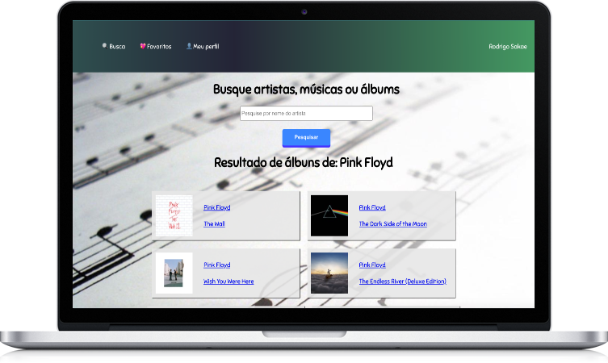

# Simple music player
Um player simples de músicas que busca conteúdo na Apple Store. Digite o nome do artista e escute 30 segundos da música que você curtir! Adicione aos favoritos e edite seu perfil nessa versão.

[Clique aqui](http://devsakae.me/musicplayer) para acessar a demonstração.

## Como instalar?
Clone este repositório usando <code>gh repo clone devsakae/musicplayer</code>

Instale as dependências necessárias usando <code>npm install</code>

Rode com <code>npm start</code>
